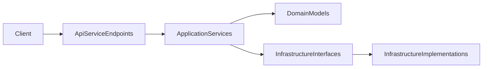

# API.ApiService Structure

## Purpose

This document describes the current code organization after refactoring `API.ApiService` from a single-file implementation into feature slices and layered projects.

## Solution Projects

- `API.ApiService` - HTTP layer (Minimal API), endpoint mapping, middleware, and DI composition.
- `API.Domain` - domain models and value objects without ASP.NET dependencies.
- `API.Application` - application services and contracts (interfaces for repositories and token generation).
- `API.Infrastructure` - technical implementations (JWT, in-memory repository, future DB adapters).
- Existing projects `API.Web`, `API.ServiceDefaults`, `API.AppHost`, `API.Tests` remain in place.

## High-Level Dependency Rules

- `API.ApiService -> API.Application`
- `API.ApiService -> API.Infrastructure`
- `API.Application -> API.Domain`
- `API.Infrastructure -> API.Application`
- `API.Infrastructure -> API.Domain`

`API.Domain` should not reference other application projects.

## API.ApiService Folder Structure

```text
API.ApiService/
  Program.cs
  Common/
    Extensions/
      ServiceCollectionExtensions.cs
  Features/
    Auth/
      AuthEndpoints.cs
      AuthContracts.cs
      AuthFeatureRegistration.cs
    Users/
      UsersEndpoints.cs
      UsersContracts.cs
      UsersFeatureRegistration.cs
    Weather/
      WeatherEndpoints.cs
```

### Responsibilities inside `API.ApiService`

- `Program.cs`
  - Keeps only composition root logic:
    - service registration
    - middleware pipeline
    - endpoint mapping calls
- `Features/*/Endpoints`
  - Defines HTTP routes (`MapGroup`, `MapGet`, `MapPost`, etc.).
  - Handles HTTP orchestration and response shaping.
- `Features/*/Contracts`
  - Contains request/response DTOs specific to HTTP API.
- `Features/*/FeatureRegistration`
  - Registers feature dependencies into DI.
- `Common/Extensions/ServiceCollectionExtensions.cs`
  - Centralized auth registration (`AddJwtAuthentication`).

## Layered Business Structure

### `API.Domain`

```text
API.Domain/
  Users/
    User.cs
```

- Contains domain records:
  - `User`
  - `UserSettings`

### `API.Application`

```text
API.Application/
  Auth/
    AuthService.cs
    IUserTokenService.cs
  Users/
    UsersService.cs
    IUsersRepository.cs
```

- `AuthService`
  - register/verify/refresh use-cases.
- `UsersService`
  - current user read/update and users search/read use-cases.
- Interfaces define dependencies on external details:
  - `IUsersRepository`
  - `IUserTokenService`

### `API.Infrastructure`

```text
API.Infrastructure/
  Auth/
    JwtOptions.cs
    JwtTokenService.cs
  Users/
    InMemoryUsersRepository.cs
```

- Implements application interfaces:
  - `JwtTokenService : IUserTokenService`
  - `InMemoryUsersRepository : IUsersRepository`
- Current data storage remains in-memory for compatibility and fast replacement later.

## Request Flow



## How to Extend the API

For a new feature (example: `Chats`):

1. Add `Features/Chats/ChatsEndpoints.cs` in `API.ApiService`.
2. Add `Features/Chats/ChatsContracts.cs` for HTTP DTOs.
3. Add or extend use-cases in `API.Application`.
4. Add repository/service interfaces to `API.Application` when needed.
5. Implement technical details in `API.Infrastructure`.
6. Register feature services in `FeatureRegistration` and map endpoints in `Program.cs`.

## Current Constraints and Next Steps

- Users repository is still in-memory (`InMemoryUsersRepository`).
- Next infrastructure step is replacing it with persistent storage (DB-backed repository) behind `IUsersRepository`.
- API contracts are preserved from the previous single-file implementation.
